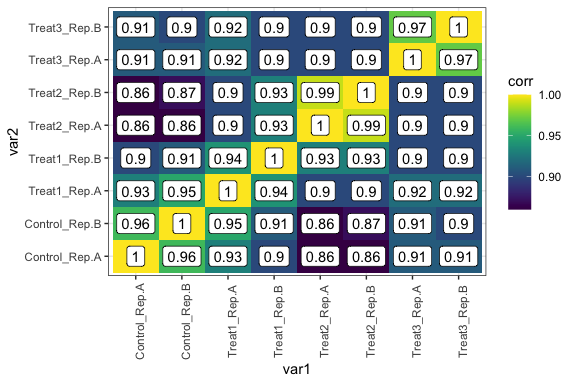

<!-- README.md is generated from README.Rmd. Please edit that file -->

# corplot

<!-- badges: start -->

<!-- badges: end -->

## Install

``` r
if(require("devtools")){
        devtools::install_github("cparsania/corplot")
} else{
        install.packages("devtools")
        devtools::install_github("cparsania/corplot")
}
```

## Correlation heatbox

## All samples vs all samples

``` r

expr_mat_file <- system.file("extdata" ,"example_data_expr_mat_01.txt" , package = "corplot")
expr_mat <- readr::read_delim(expr_mat_file , delim = "\t") 

expr_mat
#> # A tibble: 6,338 x 9
#>    gene_name Control_Rep.A Control_Rep.B Treat1_Rep.A Treat1_Rep.B Treat2_Rep.A
#>    <chr>             <dbl>         <dbl>        <dbl>        <dbl>        <dbl>
#>  1 C1_00010…          1             0            1            2.81         5.13
#>  2 C1_00020…          9.65          9.32         9.15         9.32        10.9 
#>  3 C1_00030…          5.46          4.70         4.64         5.36         6.15
#>  4 C1_00040…         10.9          10.5         11.4         12.2         11.3 
#>  5 C1_00050…          0             1            1            5.88         5.43
#>  6 C1_00060…         13.4          13.0         12.9         13.1         13.2 
#>  7 C1_00070…         12.9          12.7         12.6         12.2         11.2 
#>  8 C1_00080…         10.4           9.81        10.2          9.96        10.4 
#>  9 C1_00090…          7.33          6.61         6.13         6.88         7   
#> 10 C1_00100…         10.0          10.1         10.9         10.9         10.8 
#> # … with 6,328 more rows, and 3 more variables: Treat2_Rep.B <dbl>,
#> #   Treat3_Rep.A <dbl>, Treat3_Rep.B <dbl>

## calculate  pairwise correlation 
cor_tbl <- corplot::get_pairwise_cor_tbl(expr_mat , var = "gene_name" , method = "pearson") 

cor_tbl
#> # A tibble: 64 x 3
#>    var1          var2           corr
#>    <chr>         <chr>         <dbl>
#>  1 Control_Rep.A Control_Rep.A  1   
#>  2 Control_Rep.B Control_Rep.A  0.96
#>  3 Treat1_Rep.A  Control_Rep.A  0.93
#>  4 Treat1_Rep.B  Control_Rep.A  0.9 
#>  5 Treat2_Rep.A  Control_Rep.A  0.86
#>  6 Treat2_Rep.B  Control_Rep.A  0.86
#>  7 Treat3_Rep.A  Control_Rep.A  0.91
#>  8 Treat3_Rep.B  Control_Rep.A  0.91
#>  9 Control_Rep.A Control_Rep.B  0.96
#> 10 Control_Rep.B Control_Rep.B  1   
#> # … with 54 more rows

cp <- corplot::get_corr_heat_box(cor_tbl,var1 = var1, var2 = var2 ,value = corr) 
cp + viridis::scale_fill_viridis() + ggplot2::theme(axis.text.x = ggplot2::element_text(angle=90))
```



## Group by replicate

All samples vs all samples correlation heatbox has redundant samples on
each axis. This makes plot less readable. Alternate way to overcome this
is to plot samples of replicate 1 vs samples of replicate 2.

``` r
cor_tbl2 <- cor_tbl %>% dplyr::filter(grepl("Rep.A", var1) ) %>%  dplyr::filter(grepl("Rep.B", var2) )

cor_tbl2
#> # A tibble: 16 x 3
#>    var1          var2           corr
#>    <chr>         <chr>         <dbl>
#>  1 Control_Rep.A Control_Rep.B  0.96
#>  2 Treat1_Rep.A  Control_Rep.B  0.95
#>  3 Treat2_Rep.A  Control_Rep.B  0.86
#>  4 Treat3_Rep.A  Control_Rep.B  0.91
#>  5 Control_Rep.A Treat1_Rep.B   0.9 
#>  6 Treat1_Rep.A  Treat1_Rep.B   0.94
#>  7 Treat2_Rep.A  Treat1_Rep.B   0.93
#>  8 Treat3_Rep.A  Treat1_Rep.B   0.9 
#>  9 Control_Rep.A Treat2_Rep.B   0.86
#> 10 Treat1_Rep.A  Treat2_Rep.B   0.9 
#> 11 Treat2_Rep.A  Treat2_Rep.B   0.99
#> 12 Treat3_Rep.A  Treat2_Rep.B   0.9 
#> 13 Control_Rep.A Treat3_Rep.B   0.91
#> 14 Treat1_Rep.A  Treat3_Rep.B   0.92
#> 15 Treat2_Rep.A  Treat3_Rep.B   0.9 
#> 16 Treat3_Rep.A  Treat3_Rep.B   0.97

corplot::get_corr_heat_box(cor_tbl2,var1 = var1, var2 = var2, value = corr) + 
  viridis::scale_fill_viridis() 
```


## Scatter plot

## Group by replicates : All combinations

``` r
groups_file <- expr_mat_file <- system.file("extdata" ,"example_data_01_sample_groups.txt" , package = "corplot")
groups <- readr::read_delim(file = groups_file,delim = "\t") 

groups 
#> # A tibble: 8 x 3
#>   samples       condition repl 
#>   <chr>         <chr>     <chr>
#> 1 Control_Rep.A Control   Rep.A
#> 2 Control_Rep.B Control   Rep.B
#> 3 Treat1_Rep.A  Treat1    Rep.A
#> 4 Treat1_Rep.B  Treat1    Rep.B
#> 5 Treat2_Rep.A  Treat2    Rep.A
#> 6 Treat2_Rep.B  Treat2    Rep.B
#> 7 Treat3_Rep.A  Treat3    Rep.A
#> 8 Treat3_Rep.B  Treat3    Rep.B

csp <- corplot::get_pair_wise_scatter(dat_tbl = expr_mat, group_tbl = groups,var_plot = condition, var_plot_group = repl,dat_id = gene_name)

csp
```


### Display corr value

``` r

cor_tbl2 <- cor_tbl %>% dplyr::rename(`Rep.A`=var1, `Rep.B` = var2) %>% 
  dplyr::filter(grepl("Rep.A" ,`Rep.A`)) %>%
  dplyr::filter(grepl("Rep.B" ,`Rep.B`)) %>% 
  TidyWrappers::tbl_replace_string("_.*" , "")

cor_tbl2
#> # A tibble: 16 x 3
#>    Rep.A   Rep.B    corr
#>    <chr>   <chr>   <dbl>
#>  1 Control Control  0.96
#>  2 Treat1  Control  0.95
#>  3 Treat2  Control  0.86
#>  4 Treat3  Control  0.91
#>  5 Control Treat1   0.9 
#>  6 Treat1  Treat1   0.94
#>  7 Treat2  Treat1   0.93
#>  8 Treat3  Treat1   0.9 
#>  9 Control Treat2   0.86
#> 10 Treat1  Treat2   0.9 
#> 11 Treat2  Treat2   0.99
#> 12 Treat3  Treat2   0.9 
#> 13 Control Treat3   0.91
#> 14 Treat1  Treat3   0.92
#> 15 Treat2  Treat3   0.9 
#> 16 Treat3  Treat3   0.97

csp + ggplot2::geom_text(data = cor_tbl2,  x = 4, y = 18, ggplot2::aes(label = paste("r","=",corr , sep = "")) , 
                         fontface="italic" , col = "red",size = 5)
```


## Group by replicates : Only replicate pairs

``` r
csp2 <- corplot::get_pair_wise_scatter(dat_tbl = expr_mat, group_tbl = groups,var_plot = condition, var_plot_group = repl,dat_id = gene_name,view_matrix = FALSE)

csp2
```


### Display corr value

``` r
cor_tbl3 <- cor_tbl2 %>% dplyr::filter(`Rep.A` == `Rep.B`) 
csp3 <- corplot::get_pair_wise_scatter(dat_tbl = expr_mat, group_tbl = groups,var_plot = condition, var_plot_group = repl,dat_id = gene_name,view_matrix = FALSE)

csp2 + ggplot2::geom_text(data = cor_tbl3,  x = 3, y = 18, ggplot2::aes(label = paste("r","=",corr , sep = "")) , 
                         fontface="italic" , col = "red")
```


